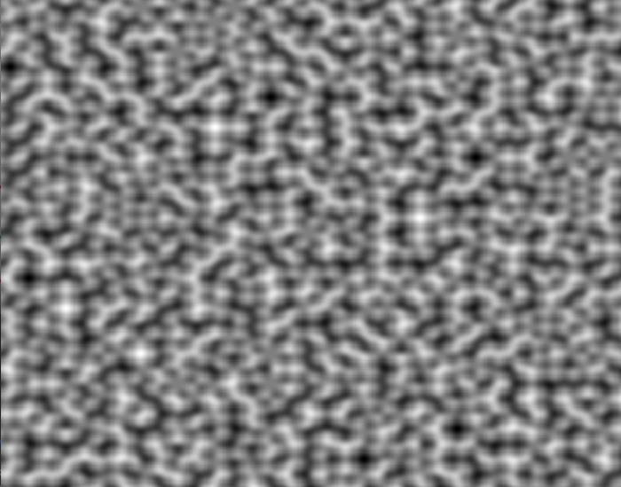

# PerlinNoise2D
<h1>Perlin Noise generator</h1>

<h3>Jar location: out/artifacts/basic_perlin/basic_perlin.jar</h3>
<h3>How to use</h3>

1. Create new Perlin Noise object:  

       
PerlinNoise perlin = new PerlinNoise(); 

2. Set canvas dimensions:  
       perlin.setDimension(width, height); 
3. Set subgrid dimensions (i.e. 32 x 32 grid in your canvas:  
       perlin.setGridDimension(gridWidth, gridHeight); 
4. Call noise funciton to get a value from 0.0 to 1.0:  
       double scale = perlin.noise(i, j); 
