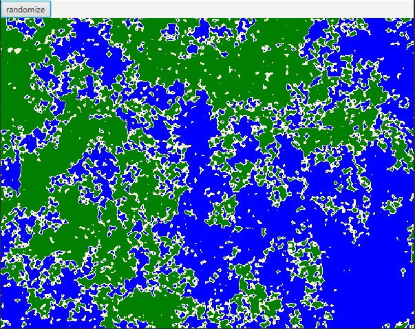

# PerlinNoise2D
<h1>Perlin Noise generator</h1>

<h3>Jar location: out/artifacts/basic_perlin/basic_perlin.jar</h3>
<h3>How to use</h3>
<b>
1. Create new Perlin Noise instance:</b>
       
PerlinNoise perlin = new PerlinNoise(); 

<b>
2. Set gradient type:</b>
       
perlin.setGradient(PerlinNoise.GradientType.RANDOM); //RANDOM, CROSS, PLUS 

<b>
3. Set canvas dimensions:</b>
       
perlin.setDimension(width, height); 

<b>
4a. Set total perlin grids within set canvas dimensions (i.e. 32 x 32 total grids) in your canvas:</b>
       
perlin.setGrids(gridsAlongWidth, gridsAlongHeight); 

<b>
4b. Set dimensions for each grid (4x4 grid dimension - not the same as total grids):</b>
       
perlin.setGridDimensions(gridWidth, gridHeight); 

<b>
5. Call noise function to get a value from 0.0 to 1.0:</b>
       
double scale = perlin.noise(i, j); //where i and j follow basic array parsing (top to bottom and left to right) 

<b>
6. Call generate to create new perlin grid with same dimensions:</b>
       
perlin.generateNoise(); 

Note 1: perlin has default dimension at 1000x1000 for 32x32 total grids and RANDOM gradient type. Each grid is (width/32) x (height/32) dimensions

Note 2: grids can be adjusted to suit customization. So each individual calls to 4a or 4b will recreate the perlin grid for calculations and override each other.

Note 3: slight artifacting remains, but disappears with 64 x 64 perlin grids

<h2>Example with importing jar library</h2>

Created multiple Perlin objects at varying dimensions and averaged values to get current land generated. Granted, this could also be done with just a single Perlin object. Estimated time to create this new land generation project: 1 hour.

